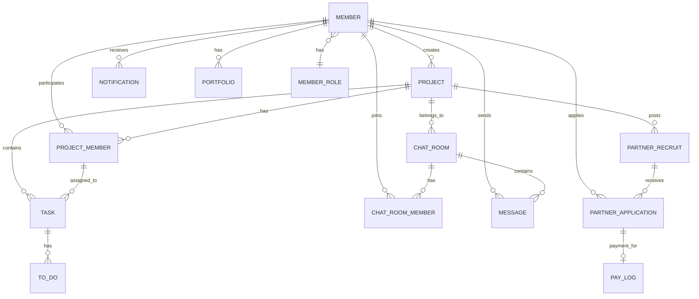

# OFF 프로젝트 기술 문서

> 프로젝트 파트너 매칭 플랫폼

---

## 📚 목차

1. [기술 스택](#1-기술-스택)
2. [서버 아키텍처](#2-서버-아키텍처)
3. [ERD (Entity Relationship Diagram)](#3-erd)
4. [주요 기능](#4-주요-기능)
5. [외부 API 연동](#5-외부-api-연동)

---

## 1. 기술 스택

### 🔧 Backend

| 분류 | 기술 | 버전 | 용도 |
|------|------|------|------|
| **Language** | Java | 21 | 개발 언어 |
| **Framework** | Spring Boot | 3.5.9 | 애플리케이션 프레임워크 |
| **Build Tool** | Gradle | - | 빌드 및 의존성 관리 |
| **ORM** | Spring Data JPA | - | 데이터베이스 접근 |
| **Database** | PostgreSQL | - | 관계형 데이터베이스 (AWS RDS) |
| **Security** | JWT (JJWT) | 0.12.5 | 인증/인가 |
| | Spring Security Crypto | - | 비밀번호 암호화 (BCrypt) |
| **Validation** | Jakarta Validation | - | 요청 데이터 검증 |
| **Real-time** | WebSocket (STOMP) | - | 실시간 채팅 |
| **Documentation** | Swagger (Springdoc) | 2.8.5 | API 문서화 |

### ☁️ Infrastructure & DevOps

| 분류 | 기술 | 용도 |
|------|------|------|
| **Cloud** | AWS EC2 | 애플리케이션 서버 |
| | AWS RDS (PostgreSQL) | 데이터베이스 서버 |
| **CI/CD** | GitHub Actions | 자동 빌드 및 배포 |
| **VCS** | Git / GitHub | 버전 관리 |

### 🔗 External APIs

| API | 용도 | 버전 |
|-----|------|------|
| **Google Gemini API** | AI 기반 프로젝트 견적 및 Task 자동 생성 | - |
| **Toss Payments API** | 파트너 매칭 결제 | - |

### 📦 주요 Dependencies

```gradle
// Core
- Spring Boot Starter Web
- Spring Boot Starter Data JPA
- Spring Boot Starter Validation
- Spring Boot Starter WebSocket

// Security
- JJWT (JWT 인증)
- Spring Security Crypto (비밀번호 암호화)

// Database
- PostgreSQL Driver
- H2 Database (테스트용)

// Documentation
- Springdoc OpenAPI (Swagger)

// External Integration
- WebFlux (Toss Payments, Gemini API 연동)

// Utilities
- Lombok (보일러플레이트 코드 제거)
- Jackson (JSON 직렬화/역직렬화)
```

---

## 2. 서버 아키텍처

### 🏗️ 전체 아키텍처

```
┌─────────────────────────────────────────────────────────────┐
│                         Client Layer                         │
│                    (Web / Mobile App)                        │
└────────────────────────────┬────────────────────────────────┘
                             │ HTTP/HTTPS
                             │ WebSocket
┌────────────────────────────▼────────────────────────────────┐
│                      Presentation Layer                      │
│  ┌──────────────────────────────────────────────────────┐  │
│  │              REST API Controllers                     │  │
│  │  - MemberController  - ProjectController             │  │
│  │  - ChatController    - PayController                 │  │
│  │  - PartnerMatchingController                         │  │
│  └──────────────────────────────────────────────────────┘  │
│  ┌──────────────────────────────────────────────────────┐  │
│  │            JWT Authentication Filter                  │  │
│  │       (JwtAuthenticationFilter)                      │  │
│  └──────────────────────────────────────────────────────┘  │
└────────────────────────────┬────────────────────────────────┘
                             │
┌────────────────────────────▼────────────────────────────────┐
│                       Business Layer                         │
│  ┌──────────────────────────────────────────────────────┐  │
│  │                Service Components                     │  │
│  │  - MemberService      - ProjectService               │  │
│  │  - ChatService        - PayFacade/PayLogService      │  │
│  │  - PartnerMatchingService                            │  │
│  │  - NotificationService                               │  │
│  └──────────────────────────────────────────────────────┘  │
└────────────────────────────┬────────────────────────────────┘
                             │
┌────────────────────────────▼────────────────────────────────┐
│                      Persistence Layer                       │
│  ┌──────────────────────────────────────────────────────┐  │
│  │              JPA Repositories                         │  │
│  │  - MemberRepository  - ProjectRepository             │  │
│  │  - ChatRoomRepository                                │  │
│  │  - PartnerApplicationRepository                      │  │
│  └──────────────────────────────────────────────────────┘  │
│  ┌──────────────────────────────────────────────────────┐  │
│  │                  JPA Entities                         │  │
│  │  - Member  - Project  - ChatRoom  - PayLog          │  │
│  └──────────────────────────────────────────────────────┘  │
└────────────────────────────┬────────────────────────────────┘
                             │
┌────────────────────────────▼────────────────────────────────┐
│                      Database Layer                          │
│              PostgreSQL (AWS RDS)                            │
└──────────────────────────────────────────────────────────────┘

┌─────────────────────────────────────────────────────────────┐
│                      External Services                       │
│  ┌──────────────┐  ┌──────────────┐  ┌──────────────┐     │
│  │ Gemini API   │  │Toss Payments│  │ AWS Services │     │
│  │ (AI 견적)    │  │   (결제)     │  │  (EC2/RDS)   │     │
│  └──────────────┘  └──────────────┘  └──────────────┘     │
└─────────────────────────────────────────────────────────────┘
```

### 📂 패키지 구조 (Domain-Driven Design)

```
com.example.off
│
├── common/                     # 공통 모듈
│   ├── config/                 # 설정 (PasswordConfig, FilterConfig)
│   ├── exception/              # 예외 처리 (OffException, OffControllerAdvice)
│   ├── response/               # 통합 응답 형식 (BaseResponse, ResponseCode)
│   ├── jwt/                    # JWT 인증 (JwtTokenProvider, Filter)
│   ├── gemini/                 # Gemini API 연동
│   ├── infra/                  # 외부 인프라 (TossPaymentsClient)
│   └── swagger/                # Swagger 설정
│
├── domain/                     # 도메인 계층 (DDD)
│   ├── member/                 # 회원 도메인
│   │   ├── Member.java         # 엔티티
│   │   ├── controller/         # API 컨트롤러
│   │   ├── service/            # 비즈니스 로직
│   │   ├── repository/         # 데이터 접근
│   │   └── dto/                # 데이터 전송 객체
│   │
│   ├── project/                # 프로젝트 도메인
│   │   ├── Project.java
│   │   ├── controller/
│   │   ├── service/            # 견적, 확정, Task 생성
│   │   ├── repository/
│   │   └── dto/
│   │
│   ├── partnerRecruit/         # 파트너 모집/매칭 도메인
│   │   ├── PartnerRecruit.java
│   │   ├── PartnerApplication.java
│   │   ├── controller/
│   │   ├── service/
│   │   └── dto/
│   │
│   ├── chat/                   # 채팅 도메인 (WebSocket)
│   │   ├── ChatRoom.java
│   │   ├── Message.java
│   │   ├── controller/
│   │   ├── service/
│   │   └── dto/
│   │
│   ├── pay/                    # 결제 도메인
│   │   ├── PayLog.java
│   │   ├── controller/
│   │   ├── service/            # PayLogService, PayFacade
│   │   └── dto/
│   │
│   ├── notification/           # 알림 도메인
│   ├── task/                   # Task 관리 도메인
│   ├── projectMember/          # 프로젝트 멤버 도메인
│   └── role/                   # 역할 도메인 (PM, DEV, DES, MAR)
│
└── OffApplication.java         # 메인 애플리케이션
```

### 🔄 요청 처리 흐름

```
1. Client Request
   ↓
2. JwtAuthenticationFilter (JWT 검증 → memberId 추출)
   ↓
3. Controller (요청 수신, Validation)
   ↓
4. Service (비즈니스 로직 처리)
   ↓
5. Repository (데이터베이스 접근)
   ↓
6. Entity (JPA 영속성 관리)
   ↓
7. Database (PostgreSQL)
   ↓
8. Response (BaseResponse<T> 형식)
   ↓
9. Client
```

### 🎯 설계 원칙

#### Layered Architecture + DDD
- **Presentation Layer**: REST API, WebSocket
- **Business Layer**: 도메인별 Service
- **Persistence Layer**: JPA Repository
- **Database Layer**: PostgreSQL

#### Entity 설계 패턴
```java
@Entity
@Getter
@NoArgsConstructor
public class Member {
    @Id @GeneratedValue
    private Long id;

    // Private constructor
    private Member(...) { ... }

    // Static factory method
    public static Member of(...) { ... }

    // Business logic methods
    public void updateNickname(...) { ... }
}
```

#### DTO 패턴
- **Request DTO**: `@NotNull`, `@NotBlank` 등 Validation
- **Response DTO**: `static of()` factory method
- **통합 응답**: `BaseResponse<T>`

#### 예외 처리
```java
throw new OffException(ResponseCode.MEMBER_NOT_FOUND);
↓
@RestControllerAdvice
public class OffControllerAdvice {
    @ExceptionHandler(OffException.class)
    public ResponseEntity<BaseResponse<Void>> handle(...) { ... }
}
```

---

## 3. ERD

### 📊 주요 엔티티 관계



### 📋 테이블 상세 설명

#### 👤 회원 관련

**member**
- `id` (PK): 회원 고유 ID
- `email`: 이메일 (로그인 ID)
- `password`: 암호화된 비밀번호 (BCrypt)
- `nickname`: 닉네임
- `phone`: 전화번호
- `profile_image`: 프로필 이미지 URL
- `self_introduction`: 자기소개
- `role`: 역할 (PM, DEV, DES, MAR)
- `project_count`: 프로젝트 경험 횟수
- `is_working`: 현재 프로젝트 진행 중 여부
- `created_at`, `updated_at`: 생성/수정 시간

**portfolio**
- `portfolio_id` (PK)
- `member_id` (FK → member)
- `title`: 포트폴리오 제목
- `description`: 설명
- `url`: 포트폴리오 링크

#### 📁 프로젝트 관련

**project**
- `project_id` (PK)
- `creator_id` (FK → member): 프로젝트 생성자 (기획자)
- `name`: 프로젝트명
- `description`: 설명
- `requirement`: 요구사항
- `introduction`: 프로젝트 소개
- `total_estimate`: 총 예상 비용
- `start_date`, `end_date`: 시작/종료일
- `project_type`: 프로젝트 타입
- `status`: 상태 (IN_PROGRESS, COMPLETED)

**project_member**
- `project_member_id` (PK)
- `project_id` (FK → project)
- `member_id` (FK → member)
- `role`: 프로젝트 내 역할

#### 🤝 파트너 모집/매칭

**partner_recruit**
- `partner_recruit_id` (PK)
- `project_id` (FK → project)
- `role`: 모집 역할 (DEV, DES, MAR)
- `number_of_person`: 모집 인원
- `cost`: 1인당 비용
- `recruit_status`: 모집 상태 (OPEN, CLOSED)

**partner_application**
- `partner_application_id` (PK)
- `partner_recruit_id` (FK → partner_recruit)
- `member_id` (FK → member): 지원자
- `application_status`: 지원 상태 (WAITING, ACCEPT, REJECT)
- `is_from_project`: 기획자 제안 여부 (true: 초대, false: 지원)

#### 💬 채팅

**chat_room**
- `chat_room_id` (PK)
- `project_id` (FK → project, nullable): 프로젝트 채팅방인 경우
- `chat_type`: 채팅 타입 (CONTACT: 1:1, PROJECT: 프로젝트)

**chat_room_member**
- `chat_room_member_id` (PK)
- `chat_room_id` (FK → chat_room)
- `member_id` (FK → member)
- `last_read_at`: 마지막 읽은 시간

**message**
- `message_id` (PK)
- `chat_room_id` (FK → chat_room)
- `member_id` (FK → member): 발신자
- `content`: 메시지 내용
- `is_read`: 읽음 여부

#### 💳 결제

**pay_log**
- `pay_log_id` (PK)
- `order_id`: Toss 주문 ID (UUID)
- `amount`: 결제 금액
- `status`: 결제 상태 (READY, PAID, FAILED, CANCELED)
- `payment_key`: Toss 결제 키
- `payer_id` (FK → member): 결제자 (기획자)
- `partner_application_id` (FK → partner_application)
- `project_member_id` (FK → project_member): 매칭 완료 시 생성

#### 🔔 알림

**notification**
- `notification_id` (PK)
- `member_id` (FK → member): 수신자
- `message`: 알림 메시지
- `url`: 알림 클릭 시 이동 URL
- `notification_type`: 알림 타입 (INVITE, APPLICATION, PAY, PROJECT_COMPLETE)
- `is_read`: 읽음 여부

#### ✅ Task 관리

**task**
- `task_id` (PK)
- `project_id` (FK → project)
- `project_member_id` (FK → project_member): 담당자
- `name`: Task 이름
- `description`: Task 설명

**to_do**
- `to_do_id` (PK)
- `task_id` (FK → task)
- `content`: ToDo 내용
- `is_done`: 완료 여부

---

## 4. 주요 기능

### 🎯 핵심 기능 흐름

#### 1️⃣ 프로젝트 생성 및 견적

```
1. 기획자: 프로젝트 견적 요청 (POST /projects/estimate)
   ↓
2. Gemini API 호출
   - 프로젝트 설명/요구사항 분석
   - 역할별 비용 산정
   - 예상 종료일 계산
   - 파트너 추천
   - 서비스 요약 생성
   ↓
3. 견적 결과 반환 (EstimateResponse)
   ↓
4. 기획자: 프로젝트 확정 (POST /projects/confirm)
   ↓
5. Project 생성 + PartnerRecruit 생성 + Task 자동 생성 (Gemini)
```

#### 2️⃣ 파트너 매칭

**시나리오 A: 파트너 지원**
```
1. 파트너: 프로젝트 지원 (POST /projects/{id}/applications)
   ↓
2. PartnerApplication 생성 (status=WAITING)
   ↓
3. 기획자에게 알림 전송
   ↓
4. 기획자: 결제 진행 (prepare → confirm)
   ↓
5. ProjectMember 생성 + 매칭 완료
```

**시나리오 B: 기획자 초대**
```
1. 기획자: 파트너 초대 (POST /projects/{id}/invitations)
   ↓
2. PartnerApplication 생성 (isFromProject=true)
   ↓
3. 파트너에게 알림 전송
   ↓
4. 파트너: 수락 (POST /invitations/{id}/accept)
   ↓
5. 기획자에게 결제 알림
   ↓
6. 기획자: 결제 진행
   ↓
7. ProjectMember 생성 + 매칭 완료
```

#### 3️⃣ 실시간 채팅 (WebSocket + STOMP)

```
1. 첫 메시지 전송 (POST /chat/rooms/first)
   - ChatRoom 생성
   - ChatRoomMember 2명 추가
   - ChatType 자동 결정 (CONTACT or PROJECT)
   ↓
2. WebSocket 연결 (/ws-stomp)
   ↓
3. 메시지 발행 (/pub/chat/message)
   ↓
4. 구독자에게 브로드캐스트 (/sub/chat/room/{roomId})
   ↓
5. 안 읽은 메시지 알림 (/queue/unread-status)
```

#### 4️⃣ Toss Payments 결제

```
1. 기획자: 결제 준비 (POST /payments/prepare)
   - PayLog 생성 (status=READY)
   - orderId, amount 반환
   ↓
2. 프론트: Toss 위젯 초기화 (clientKey)
   ↓
3. 사용자 결제 진행
   ↓
4. Toss: successUrl로 리다이렉트 (paymentKey 전달)
   ↓
5. 프론트: 결제 확인 (POST /payments/confirm)
   - Toss API 최종 승인 요청
   - PayLog 상태 업데이트 (PAID)
   - ProjectMember 생성
   - 파트너에게 알림
```

### 🔐 인증/인가

```
1. 로그인 (POST /members/login)
   ↓
2. JWT 토큰 발급 (accessToken, refreshToken)
   ↓
3. API 요청 시 Header: Authorization: Bearer {token}
   ↓
4. JwtAuthenticationFilter
   - 토큰 검증
   - memberId 추출
   - HttpServletRequest에 저장
   ↓
5. Controller에서 memberId 사용
```

---

## 5. 외부 API 연동

### 🤖 Google Gemini API

**용도:**
1. 프로젝트 견적 자동 산정
2. 파트너 추천 및 비용 차등 산정
3. Task 및 ToDo 자동 생성
4. 서비스 상세 기획안 생성

**구현:**
```java
@Service
public class GeminiService {
    private final WebClient geminiWebClient;

    public String generateText(String prompt) {
        // Gemini API 호출
        // JSON 응답 파싱
        // 결과 반환
    }
}
```

### 💳 Toss Payments API

**용도:**
파트너 매칭 결제

**플로우:**
1. **준비 단계**: PayLog 생성 (READY)
2. **결제 단계**: Toss 위젯 (클라이언트)
3. **승인 단계**: Toss API 호출 (서버) → PAID

**구현:**
```java
@Component
public class TossPaymentsClient {
    private final WebClient tossWebClient;

    public TossPaymentConfirmResponse confirm(
        String paymentKey, String orderId, Long amount
    ) {
        // Toss API 승인 요청
        // Basic Auth (secretKey)
    }
}
```

---

## 📈 성능 최적화

### N+1 쿼리 해결
```java
@Query("SELECT m FROM Member m " +
       "JOIN FETCH m.portfolios " +
       "WHERE m.id = :id")
Optional<Member> findByIdWithPortfolios(@Param("id") Long id);
```

### JOIN FETCH 활용
```java
@Query("SELECT crm FROM ChatRoomMember crm " +
       "JOIN FETCH crm.chatRoom cr " +
       "LEFT JOIN FETCH cr.project " +
       "JOIN FETCH crm.member " +
       "WHERE crm.member.id = :memberId")
List<ChatRoomMember> findAllByMember_IdAndChatRoom_ChatType(...);
```

---

## 🚀 배포 프로세스

### GitHub Actions CI/CD

```yaml
on:
  push:
    branches: [ develop ]

jobs:
  build:
    - Gradle build
    - JAR 생성

  deploy:
    - EC2에 JAR 배포
    - 환경 변수 설정 (.env)
    - systemd로 앱 재시작
```

### 환경 변수 관리

- **로컬**: `.env` 파일
- **배포**: GitHub Secrets → EC2 `.env` 자동 생성

---

## 📝 API 명세

**Swagger UI:** `/swagger-ui/index.html`

**통합 응답 형식:**
```json
{
  "success": true,
  "code": 200,
  "message": "요청에 성공하였습니다.",
  "data": { ... }
}
```

---
